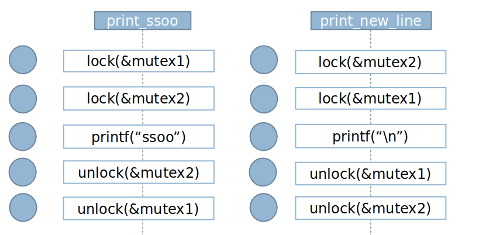

# Lab 10 Introduction to concurrency

## Goals

Practice using some of the synchronization mechanisms:
- Threads 
- Mutex and Condition variables

## Statements

###  Exercise 01

Given the following code, it is requested to implement the odd and even functions so that one thread prints the even numbers from 0 to 199 and the other, the odd numbers from 0 to 199 consecutively. An example of the output would be the following:


```
EvenThread = 0
OddThread = 1
EvenThread = 2
OddThread = 3
EvenThread = 4
OddThread = 5
EvenThread = 6

.....


```

```
#include <unistd.h>
#include <stdio.h>
#include <stdlib.h>
#include <pthread.h>
#include <sys/types.h>
#include <sys/stat.h>
#include <fcntl.h>
#include <stdbool.h>

int shared_data = 0;
bool even;

pthread_mutex_t mutex;
pthread_cond_t waitEven;
pthread_cond_t waitOdd;


int exercise01(){
  
  pthread_t th1, th2;
    
  pthread_mutex_init (&mutex, NULL);
  pthread_cond_init (&waitEven, NULL);
  pthread_cond_init (&waitOdd, NULL);
  
  pthread_create(&th1,NULL,oddThread,NULL);
  pthread_create(&th2,NULL,evenThread,NULL);
	
  // I wait for the completion of the thread
    
  pthread_join(th1,NULL);
  pthread_join(th2,NULL);
   
  pthread_mutex_destroy(&mutex);
  pthread_cond_destroy(&waitEven);
  pthread_cond_destroy(&waitOdd);

  return(0);
}

```

#### Option A


```
void *evenThread(void *arg) {
   
    for(int i=0; i < 100; i++ ) {
      pthread_mutex_lock (&mutex);
      if (!even)  {
	      pthread_cond_signal(&waitOdd,&mutex);
      }
      printf ("EvenThread = %d\n", shared_data++);
	  
	    even=true;
      pthread_cond_wait(&waitEven);
      pthread_mutex_unlock(&mutex);
    }
}

void *oddThread(void *arg) {
    for(int i=0; i < 100; i++ ) {
      pthread_mutex_lock (&mutex);
      if (even)  {
	      pthread_cond_signal(&waitEven,&mutex);
      }
      printf ("OddThread = %d\n", shared_data++);
	  
	    even=false;
      pthread_cond_wait(&waitOdd);
      pthread_mutex_unlock(&mutex);
    }
}


```
#### Option B

```
void *evenThread(void *arg) {
   
    for(int i=0; i < 100; i++ ) {
      pthread_mutex_lock (&mutex);
      if (!even)  {
	      pthread_cond_wait(&waitOdd,&mutex);
      }
      printf ("EvenThread = %d\n", shared_data++);
	  
	    even=true;
      pthread_cond_signal(&waitEven);
      pthread_mutex_unlock(&mutex);
    }
}

void *oddThread(void *arg) {
    for(int i=0; i < 100; i++ ) {
      pthread_mutex_lock (&mutex);
      if (even)  {
	      pthread_cond_wait(&waitEven,&mutex);
      }
      printf ("OddThread = %d\n", shared_data++);
	  
	    even=false;
      pthread_cond_signal(&waitOdd);
      pthread_mutex_unlock(&mutex);
    }
}

```
#### Option C

```
void *evenThread(void *arg) {
   
    for(int i=0; i < 100; i++ ) {
      pthread_mutex_lock (&mutex);
      if (!even)  {
	      pthread_cond_wait(&waitOdd,&mutex);
      }
      printf ("EvenThread = %d\n", shared_data++);
	  
	    even=true;
      pthread_cond_signal(&waitEven);
      pthread_mutex_unlock(&mutex);
    }
}

void *oddThread(void *arg) {
    for(int i=0; i < 100; i++ ) {
      pthread_mutex_lock (&mutex);
      if (even)  {
	      pthread_cond_wait(&waitEven,&mutex);
      }
      printf ("OddThread = %d\n", shared_data++);
	  
	    even=false;
      pthread_cond_signal(&waitOdd);
      pthread_mutex_unlock(&mutex);
    }
}
```

#### Option D

```
void *evenThread(void *arg) {
   
    for(int i=0; i < 200; i++ ) {
      pthread_mutex_lock (&mutex);
      if (!even)  {
	      pthread_cond_wait(&waitOdd,&mutex);
      }
      printf ("EvenThread = %d\n", shared_data++);
	  
	    even=true;
      pthread_cond_signal(&waitEven);
      pthread_mutex_unlock(&mutex);
    }
}

void *oddThread(void *arg) {
    for(int i=0; i < 200; i++ ) {
      pthread_mutex_lock (&mutex);
      if (even)  {
	      pthread_cond_wait(&waitEven,&mutex);
      }
      printf ("OddThread = %d\n", shared_data++);
	  
	    even=false;;
      pthread_cond_signal(&waitOdd);
      pthread_mutex_unlock(&mutex);
    }
}

```
###  Exercise 02

A student has provided us with the following code, in which different threads are created from the main process that execute the print () function:

````
#include <stdio.h>
#include <stdlib.h>
#include <pthread.h>
#include <string.h>
#include <stdbool.h>

#define N 3

pthread_t thread1, thread2; 
pthread_attr_t attr; /* threads atributes*/
  
pthread_mutex_t printer=PTHREAD_MUTEX_INITIALIZER;
pthread_cond_t printHello;
pthread_cond_t printWorld;
  
bool printHi = true;
````

````
void exercise02 (void)
{
    pthread_cond_init(&imprimirHola, NULL);
    pthread_cond_init(&imprimirMundo, NULL);
    char cadena_hola[]="Hola ";
    char cadena_mundo[]="mundo \n";
    int i;
    pthread_attr_init (&attr);
    for (i=1; i<=N; i++) {
        pthread_create(&thread2, &attr, 
	imprimir, (void *)cadena_mundo);
        pthread_create(&thread1, &attr, 
	imprimir, (void *)cadena_hola);
    }
    pthread_exit (NULL);
}


````


Implementation of function print()

````
void *print (void *arg){
  
        char cadena_hola[] = "Hello ";
        char a[12];
        pthread_mutex_lock (&printer);
        strcpy(a, (char*)arg);
        if (strncmp(a,cadena_hola,5)==0) {
          while (!printHi) {                          
                    pthread_cond_wait(&printHello,&printer);
          }
          printf("%s", a);
          printHi = false;
          pthread_cond_signal(&printWorld);
        } 
        else {
                while (printHi){
                    pthread_cond_wait(&printWorld,&printer);
                }
                printf("%s", a);
                printHi = true;
                pthread_cond_signal(&printHello);
        }
        pthread_mutex_unlock (&printer);
        pthread_exit (NULL);
}

````

After executing the program, which of the following results could we obtain on the screen?

#### Option a

````
Hello world
Hello world
Hello world
````

#### Option b
````
world
Hello world
Hello world
Hello
````

#### Option c
````
world
Hello world
world
Hello Hello
````

#### Option d

All the options

###  Exercise 03

Implementation de la solution to reader-writers problems

````
void * Lector(void *p) {
    long i=(long)p;
    while(1) {
        pthread_mutex_lock(&mutex);
        if(escribiendo)
            pthread_cond_wait(&leer,&mutex);
        leyendo++;
        pthread_mutex_unlock(&mutex);

        printf(“Lector %ld: Dato = %d\n", i, dato);
        sleep(1); //tardo 1s en leer

        pthread_mutex_lock(&mutex);
        leyendo--;
        if(!leyendo)
            pthread_cond_signal(&escribir);
        pthread_mutex_unlock(&mutex);
    }
}

````

````
void * Escritor(void * p)
{
   long i=(long)p;
   while(1)
   {
        pthread_mutex_lock(&mutex);
        while(leyendo||escribiendo)
            pthread_cond_wait(&escribir,&mutex);
        escribiendo++;
        pthread_mutex_unlock(&mutex);
        sleep(1); //tardo 1 sg en escribir
        dato+=2;
        printf(“Escritor %ld: Dato = %d\n", i, dato);
        pthread_mutex_lock(&mutex);
        escribiendo--;
        pthread_cond_broadcast(&escribir);
        pthread_cond_broadcast(&leer);
        pthread_mutex_unlock(&mutex);
   }
}

````

Which alternative to the readers and writers problem is solved by the following code? 

- Priority for Readers 
- Priority for Writers

###  Exercise 04

What execution secuence will create a deadlock?

```
#include <stdio.h>
#include <stdlib.h>
#include <string.h>
#include <pthread.h>
#include <unistd.h>

pthread_mutex_t mutex1 = PTHREAD_MUTEX_INITIALIZER;
pthread_mutex_t mutex2 = PTHREAD_MUTEX_INITIALIZER;

void* print_ssoo(void *ptr);

void* print_new_line(void *ptr);

int main() {

    pthread_t t1, t2;
    
    pthread_create(&t1, NULL, print_ssoo, NULL);
    pthread_create(&t2, NULL, print_new_line, NULL);
    
    pthread_join(t1,NULL);
    pthread_join(t2,NULL);
}

void* print_ssoo(void *ptr) {

    pthread_mutex_lock(&mutex1);
    pthread_mutex_lock(&mutex2);
    
    printf("SSOO");
    
    pthread_mutex_unlock(&mutex2);
    pthread_mutex_unlock(&mutex1);
    
    pthread_exit(0);

}

void* print_new_line(void *ptr) {

    pthread_mutex_lock(&mutex2);
    pthread_mutex_lock(&mutex1);
    
    printf("\n");
    
    pthread_mutex_unlock(&mutex1);
    pthread_mutex_unlock(&mutex2);
    
    pthread_exit(0);
}
```



###  Exercise 05

Implement a program that solves the producer-consumer problem with POSIX Semaphores. The program describes two threads, producer and consumer, that share a finite size buffer. 
The producer's task is to generate an integer, store it, and start over; 
The consumer takes (simultaneously) numbers one by one. 
The problem is that the producer does not add more numbers than the buffer capacity and that the consumer does not try to take a number if the buffer is empty.

